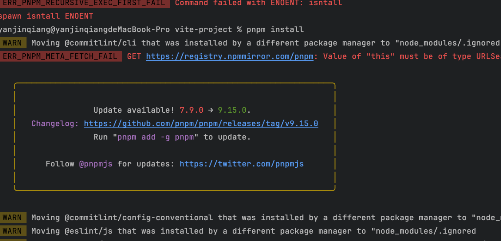

### esbuild
https://esbuild.bootcss.com/

### 升级
* ~~* vite->v6~~
* ~~* react->v19~~
* pnpm 需要升级到9.15

~~* 打包编译速度~~

### ts类型定义
// 请求参数
interface LoginRequest {
username: string;
password: string;
}

// 响应数据
interface LoginResponse {
token: string;
userId: string;
}

### todo
* ~~四个Tabs、缓存Tabs、缓存页面(4个Tab和一个Tab)~~、~~拦截功能~~、~~~~文件设计（bizhooks,component）~~、~~路由设计~~、~~~~框架主题色~~、~~scss文件设计~~
* ~~路由404重定向~~、~~缓存路由清除缓存key（tab，非tab）~~、~~todo 使用React-router-domv6 404 重定向~~
~~* httpPlug自定义第三方组件，如loading等；优先级低~~
* ~~parameter：获取用户信息~~
~~* scss与处理器~~
  ~~* 设计全局公用的变量和方法~~
  * ~~预处理的基础和方法需要重新学习~~
* ~~GoldStart 冷启动：未登录拦截器、全局接口初始化~~
~~* 学习package.json文件中的库~~
* ~~登陆权限~~
~~* 引入zustand.js?（功能与mobx一样）~~
~~* mobx、mobx-react~~
  ~~* 自定义mobx持久化功能~~
* ~~加密工作~~
  * ~~持久化的数据加密操作~~
  * ~~url链接加密~~
* ~~添加React错误组件ErrorBoundary~~
* 设计business hooks（这个business尚存问题，后期实战后再做调整）
~~* 与app交互（WebViewJavascriptBridge）~~
  ~~* https://github.com/marcuswestin/WebViewJavascriptBridge~~
  ~~* https://github.com/Lision/WKWebViewJavascriptBridge~~
* H5项目和微信小程序交互
~~* 别名设计~~
~~* 增加适配移动端的video和audio~~
* 项目中支持的组件库以及支持的功能：
  * xxxx（后续补充）

### 具体功能
~~* 登陆权限管理~~
~~* 完成登录页面开发~~
  ~~* 登录后返回上一级页面~~~~
* 图表
* 微服务、
  * @originjs/vite-plugin-federation（模块联邦）
    * 主子应用build必须使用"esnext"，对于低版本的浏览器兼容不太好，模块联邦对于本地开发模式调试不便（vite）
      * 项目中可以使用组件、公用方法、单独的应用
      * 推荐使用Monorepo家狗管理多微应用和主应用
      * React和Vue都可以混用，但是需要做适配器，最好的方式还是统一技术（react）
  * qiankun和originjs/vite-plugin-federation区别
    * qiankun可以兼容古老的项目和不可构建的项目，qiankun作为中心基座，控制路由和参数传递，各个项目可以独立运行。
    * 模块联邦仅支持编译成模块联邦的项目（vite、webpack等）无编译的不可使用。无中心化，任何项目都可以集成，各个项目作为依赖项被引用。
* 原项目组件库
  * 迁移有价值的组件库或者功能
    * tableScroll（可作为私有组件库 ）
    ~~* order可以使用mobx中的reaction~~
    * slideTabs
    * 自定义密码弹窗（PasswordModal）
    * 倒计时组件（DateCountDown）
    * 电话薄功能
    ~~* 浮标~~
~~* 全局组件控制逻辑~~
  ~~* 大屏广告~~
  ~~* 采用策略模式触发不同组件（缺少周期管理）~~
  ~~* 项目冷启动（全局初始化、自动登录、skd加载）、sdk加载~~
  ~~* 接入第三方渠道、第三方渠道方法隔离~~
  ~~* 包括方法隔离和接口隔离~~
  ~~* 隔离组件~~
* 未研究的库
  * p-limit
  * React-use
  * motion
  * es-toolkit
  * zod.js（需要重点学习此库）
* 未研究
  * react19版本的学习
* jsTest

* 问题记录
  * 配置推荐的eslint貌似不起作用
  * 导入文件时为什么需要添加尾缀
  * 微信小程序、umi、h5公用了http网络框架可以迁移到NPM库上

### 重要事项
* 标准的css命名规则：kebab-case
* react19 + mobile v5 toast, moblie v5不兼容
  * https://github.com/ant-design/ant-design-mobile/issues/6817
* 图片还是按模块存放比较合理
* 

